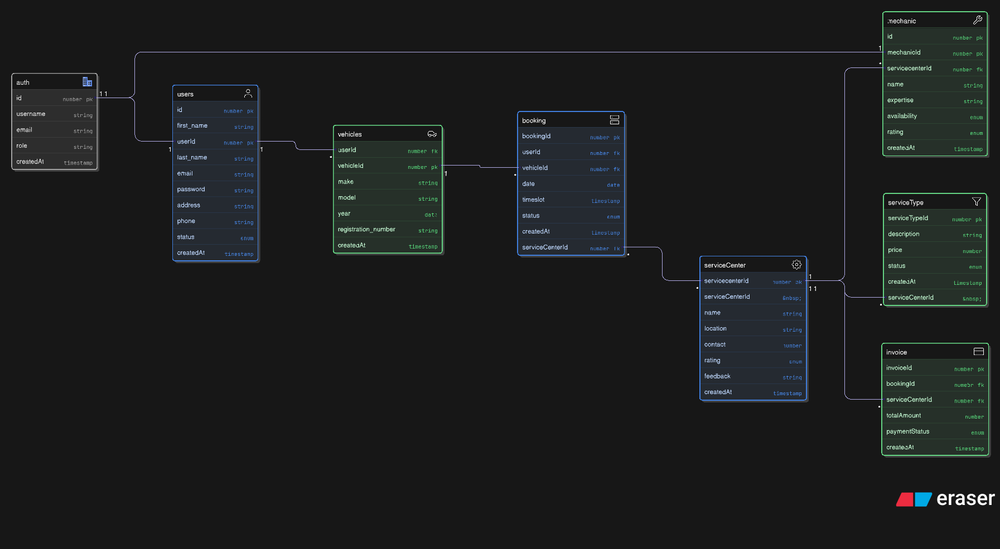

# React + Vite

This template provides a minimal setup to get React working in Vite with HMR and some ESLint rules.

Currently, two official plugins are available:

- [@vitejs/plugin-react](https://github.com/vitejs/vite-plugin-react/blob/main/packages/plugin-react) uses [Babel](https://babeljs.io/) for Fast Refresh
- [@vitejs/plugin-react-swc](https://github.com/vitejs/vite-plugin-react/blob/main/packages/plugin-react-swc) uses [SWC](https://swc.rs/) for Fast Refresh

Database Schema Design

## Expanding the ESLint configuration

If you are developing a production application, we recommend using TypeScript with type-aware lint rules enabled. Check out the [TS template](https://github.com/vitejs/vite/tree/main/packages/create-vite/template-react-ts) for information on how to integrate TypeScript and [`typescript-eslint`](https://typescript-eslint.io) in your project.

## ENDPOINTS...
### Booking

Method	      Endpoint	                              Description
POST	      /booking	                          Create a new booking
GET	          /booking	                             Get all bookings
GET	      /booking/:bookingId	                     Get booking by ID
GET	     /booking/user/:userId	                 Get bookings by user ID
GET	   /booking/vehicle/:vehicleId	           Get bookings by vehicle ID
GET	  /booking/service/:serviceCenterId	   Get bookings by service center ID
PUT	    /booking/:bookingId	                       Update booking by ID
PATCH	/booking/:bookingId	               Partially update booking by ID
DELETE	/booking/:bookingId	                   Delete booking by ID